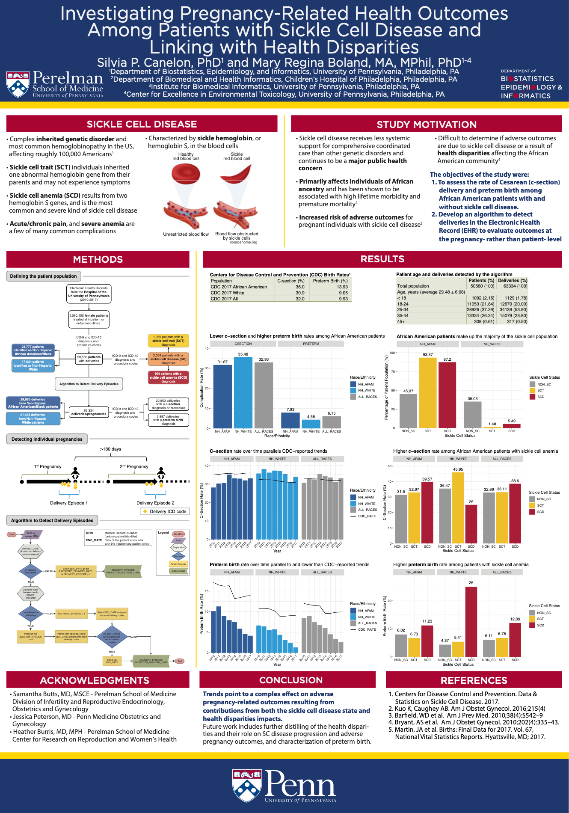

Poster presented at the 2019 American Medical Informatics Association Annual Symposium held November 16th-20th in Washington D.C.
  

<!--
<iframe
    src="./2019_AMIA_annual_symposium.pdf"
    width="100%"
    height="950px"
    style="border:none;">
</iframe>
-->
